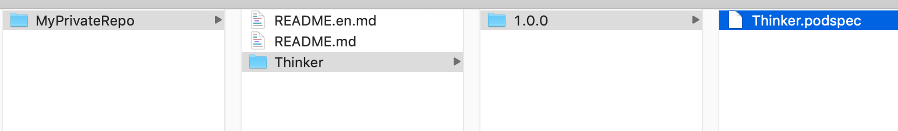

私有Pod

[官网Private Pods](http://guides.cocoapods.org/making/private-cocoapods.html)

参考: [HERE](https://my.oschina.net/llfk/blog/3105887)

总体流程：creating a private repository, letting CocoaPods know where to find it and adding the podspecs to the repository.

我们使用pod install时，会寻找cocoapod官方github上的repository中的podspec并安装库，也可以弄一个自己的repository并把自己的私有库放里面

### 1. 创建私有索引库

安装Cocoapods会到官方的索引库，生成本地索引库。使用Pod install时，默认情况下，会更新本地索引库，当然了可以在后面添加--no-repo-update忽略更新。
这个本地索引库地址默认为: `~/.cocoapods/repos/`

这个索引库其实就是存储了一个个库的podspec描述文件。使用pod repo查看本地索引库（pod repo list可以列出所以索引库）：

```ruby
$ pod repo
master
- Type: git (master)
- URL:  https://github.com/CocoaPods/Specs.git # 公共索引库的地址
- Path: /Users/liuweizhen/.cocoapods/repos/master
```

上面的URL地址就是公共索引库的地址，里面存放着很多库的podspec索引文件。为了使我们私有的库也支持cocoapods就需要创建私有的索引库。

为了演示，我们可以在[码云](https://gitee.com/)上新建一个自己的私有仓库MyPrivateRepo作为索引库（使用GitHub也可以）, 然后使用`pod repo add`命令将私有库添加到本地：

```ruby
pod repo add MyPrivateRepo https://gitee.com/aCommonChinese/MyPrivteRepo.git
```

再用pod repo查看本地pod索引库:

```
$ pod repo
master
- Type: git (master)
- URL:  https://github.com/CocoaPods/Specs.git
- Path: /Users/liuweizhen/.cocoapods/repos/master

MyPrivateRepo
- Type: git (master)
- URL:  https://gitee.com/aCommonChinese/MyPrivteRepo.git
- Path: /Users/liuweizhen/.cocoapods/repos/MyPrivateRepo
```

至此，本地私有索引库创建完成。

### 2. 创建需要引用的资源

接下来我们建一个git项目：[MyThinker](https://gitee.com/aCommonChinese/MyThinker), 在此目录下建个工程


然后上传到git上：
```
git add *
git commit -m "Init"
git push
git tag 1.0.0
git push --tag # 上传tag
```

### 3. 创建podspec文件，引用资源

参见[官网](https://guides.cocoapods.org/syntax/podspec.html)

`pod spec create Thinker`
这会生成Thinker.podspec文件，内容：

```ruby
Pod::Spec.new do |s|
    s.name         = 'Thinker' #此名字应当和文件名相同，即文件名为Thinker.podspec, 此name当为Thinker
    s.version      = '1.0.0' #这里的version和tag保持一致
    s.summary      = 'pod summary here'
    s.homepage     = 'https://gitee.com/aCommonChinese/MyThinker/'
    s.license      = 'MIT'
    s.authors      = {'aCommonChinese' => 'liuxing8807@126.com'}
    s.platform     = :ios, '10.0'
    s.source       = {:git => "https://gitee.com/aCommonChinese/MyThinker.git", :tag => s.version}
    s.source_files = 'MyThinkerDemo/MyThinkerDemo/Thinker/*.{h,m}'
    s.resource     = 'MyThinkerDemo/MyThinkerDemo/Thinker/Thinker.bundle'
    s.frameworks   = "UIKit"
    s.requires_arc = true
end
```

关于source_files可参见[官网](https://guides.cocoapods.org/syntax/podspec.html#group_file_patterns)

### 4. 把podspec文件上传到私有索引库

可以参见：<a href="#file:///提交本地Pod.html">提交本地Pod</a>

上传之前先检测一下此podspec是否合法：
`pod spec lint Thinker.podspec`，验证通过后上传到私有库：
```ruby
pod repo push MyPrivateRepo 
# 如果有多个，可指定名字：pod repo push MyPrivateRepo Thinker.podspec 
```

这样上传之后我们可以打开：`open ~/.cocoapods/repos`, 发现：


### 5. 使用私有库
使用前可以通过pod search查询：

```
pod search Thinker

-> Thinker (1.0.0)
   pod summary here
   pod 'Thinker', '~> 1.0.0'
   - Homepage: https://gitee.com/aCommonChinese/GitBookDemos_Thinker/
   - Source:   https://gitee.com/aCommonChinese/GitBookDemos_Thinker.git
   - Versions: 1.0.0 [MyPrivateRepo repo]
```

接下来新建一项目，编辑Podfile：
```ruby
source 'https://github.com/CocoaPods/Specs.git' #官方source
source 'https://gitee.com/aCommonChinese/MyPrivateRepo.git' #注意此source必须添加，否则找不到Thinker
platform :ios, '7.0'

target 'UseThinkerDemo' do
  use_frameworks!
  #pod 'AFNetworking'
  pod 'Thinker', '1.0.0'
end
```

执行`pod install`，使用即可：
```Objective-C
#import <Thinker/Person.h>
...

- (void)viewDidLoad {
    [super viewDidLoad];
    // Do any additional setup after loading the view.
    
    Person *p = [[Person alloc] init];
    self.imageView.image = [p think];
}
```

### 6. 移除私有库
`pod repo remove [name]`

---------------------------------------------------------------

### 续 升级podspec
git的tag不区分branch，tag必须是唯一的，因为可以在分支上打tag，然后上传
基本上只需要修改version即可，然后调用 `pod repo push --allow-warnings MyPrivateRepo Thinker.podspec ` 重新上传


### 遇到的错误
使用pod search可以找到，但使用pod install时出现：`Unable to find a specification for ...`
参见：[https://cloud.tencent.com/developer/article/1336298](https://cloud.tencent.com/developer/article/1336298)

[!] The spec did not pass validation, due to 2 warnings (but you can use `--allow-warnings` to ignore them).

```shell
pod repo push --allow-warnings MyPrivateRepo Thinker.podspec 
```

参考链接：

[https://blog.csdn.net/lincsdnnet/article/details/79836974](https://blog.csdn.net/lincsdnnet/article/details/79836974)
[https://cloud.tencent.com/developer/article/1336298](https://cloud.tencent.com/developer/article/1336298)


