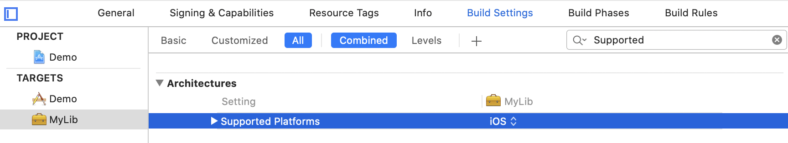
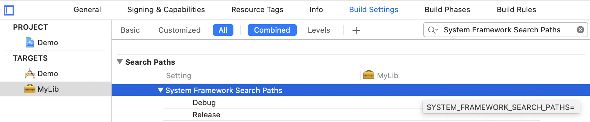
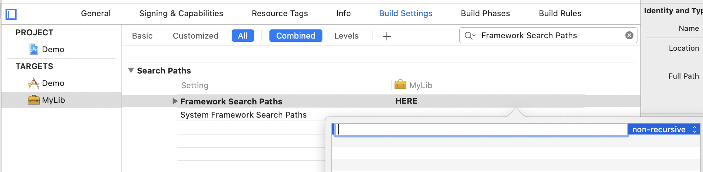
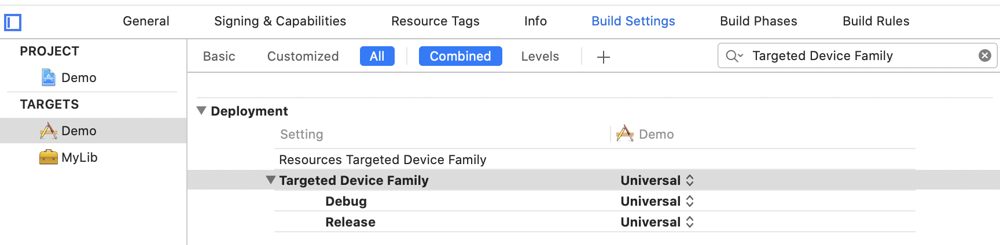
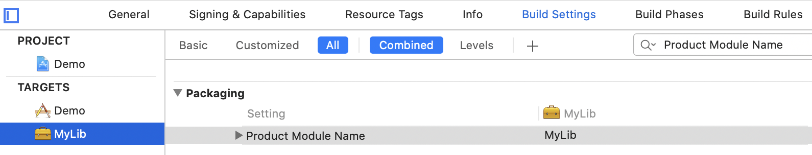
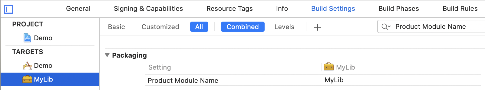
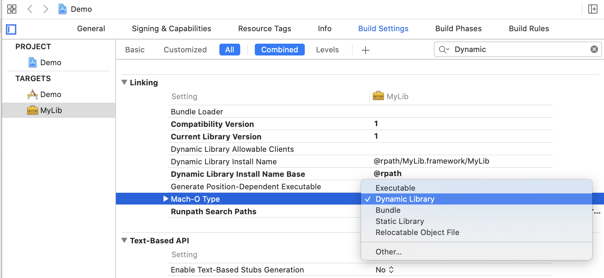

# build_settings

[Apple](https://help.apple.com/xcode/mac/11.4/#/itcaec37c2a6)

一些常用的宏

**SRCROOT**
Identifies the directory containing the target’s source files.  

**Supported Platforms (SUPPORTED_PLATFORMS)**
The list of supported platforms from which a base SDK can be used. This setting is used if the product can be built for multiple platforms using different SDKs.  

**System Framework Search Paths (SYSTEM_FRAMEWORK_SEARCH_PATHS)**

**Base SDK (SDKROOT)**
The name or path of the base SDK being used during the build. The product will be built against the headers and libraries located inside the indicated SDK. This path will be prepended to all search paths, and will be passed through the environment to the compiler and linker. Additional SDKs can be specified in the [Additional SDKs (ADDITIONAL_SDKS)](https://help.apple.com/xcode/mac/11.4/#/itcaec37c2a6?sub=deva1a5b1b82) setting.

**Framework Search Paths (FRAMEWORK_SEARCH_PATHS)** 
This is a list of paths to folders containing frameworks to be searched by the compiler for both included or imported header files when compiling C, Objective-C, C++, or Objective-C++, and by the linker for frameworks used by the product. Paths are delimited by whitespace, so any paths with spaces in them must be properly quoted.
 
这一点经常用到, 如果主工程需要引用一个三方framework, 而子模块也城要引用它, 可以只在主工程中引用一份, 而在子模块中通过此选项设置引用路径

**Library Search Paths**  
This is a list of paths to folders to be searched by the linker for libraries used by the product. Paths are delimited by whitespace, so any paths with spaces in them need to be properly quoted. 
类似于Framework Search Paths, 只不过Library Search Paths设置的是静态库

**Targeted Device Family (TARGETED_DEVICE_FAMILY)** 

**Product Module Name (PRODUCT_MODULE_NAME)**  
The name to use for the source code module constructed for this target, and which will be used to import the module in implementation source files. Must be a valid identifier. 

**Product Name (PRODUCT_NAME)**
This is the basename of the product generated by the target.  

**Project Name (PROJECT_NAME)** 
The name of the current project.

**Provisioning Profile (PROVISIONING_PROFILE_SPECIFIER)**
Must contain a profile name (or UUID). A missing or invalid profile will cause a build error. Use in conjunction with [Development Team (DEVELOPMENT_TEAM)](https://help.apple.com/xcode/mac/11.4/#/itcaec37c2a6?sub=dev186481df2) to fully specify provisioning profile.

**SCRIPTS_FOLDER_PATH**
Specifies the directory that contains the product’s scripts. 

**Mach-O Type (MACH_O_TYPE)** 
This setting determines the format of the produced binary and how it can be linked when building other binaries. For information on binary types, see [Building Mach-O Files](https://developer.apple.com/library/content/documentation/DeveloperTools/Conceptual/MachOTopics/1-Articles/building_files.html#//apple_ref/doc/uid/TP40001828-SW1) in [Mach-O Programming Topics](https://developer.apple.com/library/content/documentation/DeveloperTools/Conceptual/MachOTopics/0-Introduction/introduction.html).

- *Executable:* Executables and standalone binaries and cannot be linked. `mh_execute`
- *Dynamic Library:* Dynamic libraries are linked at build time and loaded automatically when needed. `mh_dylib`
- *Bundle:* Bundle libraries are loaded explicitly at run time. `mh_bundle`
- *Static Library:* Static libraries are linked at build time and loaded at execution time. `staticlib`
- *Relocatable Object File:* Object files are single-module files that are linked at build time. `mh_object`

一般用它选择所建的库是动态库还是静态库  

**Module Map File (MODULEMAP_FILE)** 

This is the project-relative path to the LLVM module map file that defines the module structure for the compiler. If empty, it will be automatically generated for appropriate products when [Defines Module (DEFINES_MODULE)](https://help.apple.com/xcode/mac/11.4/#/itcaec37c2a6?sub=dev82471c743) is enabled.

**Product Bundle Identifier (PRODUCT_BUNDLE_IDENTIFIER)**  
A string that uniquely identifies the bundle. The string should be in reverse DNS format using only alphanumeric characters (A-Z, a-z, 0-9), the dot (.), and the hyphen (-). This value is used as the CFBundleIdentifier in the Info.plist of the built bundle.

**Objective-C Bridging Header (SWIFT_OBJC_BRIDGING_HEADER)**  
Path to the header defining the Objective-C interfaces to be exposed in Swift.

**Objective-C Generated Interface Header Name (SWIFT_OBJC_INTERFACE_HEADER_NAME)**  

Name to use for the header that is generated by the Swift compiler for use in `#import` statements in Objective-C.

**Target Name (TARGET_NAME)**  
The name of the current target.  

