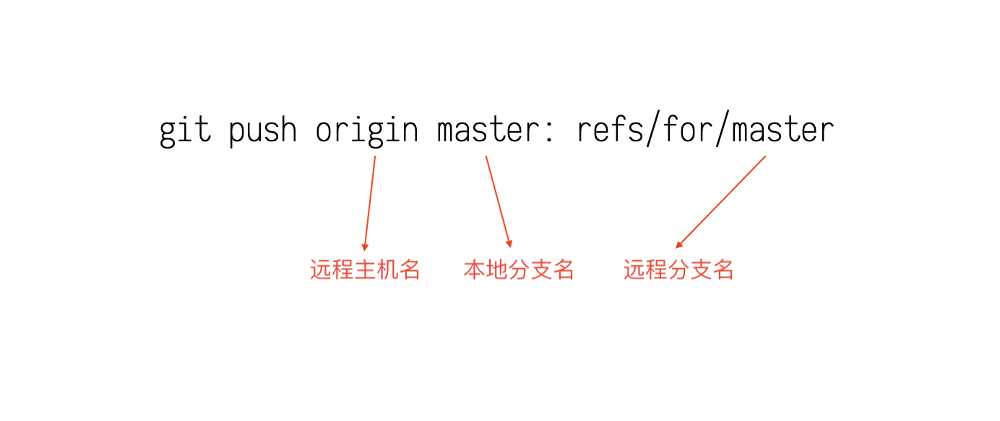

# push

参考： 

- [https://www.cnblogs.com/qianqiannian/p/6008140.html](https://www.cnblogs.com/qianqiannian/p/6008140.html)

在使用git commit命令将修改从暂存区提交到本地版本库后，只剩下最后一步将本地版本库的分支推送到远程服务器上对应的分支了  

git push <远程主机名> <远程分支名>: <本地分支名> <远程分支名>  

### 常用命令

- `git push origin master`  
把本地master推送到远程master  
省略远程分支，表示将本地分支推送到与之存在追踪关系的远程分支（通常两者同名），如果该远程分支不存在，则会被新建  
  
- `git push origin ：refs/for/master`   
省略本地分支名，表示删除指定的远程分支，因为这等同于推送一个空的本地分支到远程分支，等同于 `git push origin --delete master`    

- `git push origin`  
如果当前分支与远程分支存在追踪关系，则本地分支和远程分支都可以省略，将当前分支推送到origin主机的对应分支   

- `git push`    
如果当前分支只有一个远程分支，那么主机名都可以省略，形如 git push，可以使用git branch -r ，查看远程的分支名   

### 其他命令  
（1） git push -u origin master 如果当前分支与多个主机存在追踪关系，则可以使用 -u 参数指定一个默认主机，这样后面就可以不加任何参数使用git push，不带任何参数的git push，默认只推送当前分支，这叫做simple方式，还有一种matching方式，会推送所有有对应的远程分支的本地分支， Git 2.0之前默认使用matching，现在改为simple方式， 如果想更改设置，可以使用git config命令。git config --global push.default matching OR git config --global push.default simple；可以使用git config -l 查看配置  
（2） git push --all origin 当遇到这种情况就是不管是否存在对应的远程分支，将本地的所有分支都推送到远程主机，这时需要 -all 选项  
（3） git push --force origin git push的时候需要本地先git pull更新到跟服务器版本一致，如果本地版本库比远程服务器上的低，那么一般会提示你git pull更新，如果一定要提交，那么可以使用这个命令。  
（4） git push origin --tags //git push 的时候不会推送分支，如果一定要推送标签的话那么可以使用这个命令  

### 关于 refs/for  
refs/for 的意义在于我们提交代码到服务器之后是需要经过code review 之后才能进行merge的，而refs/heads 不需要  