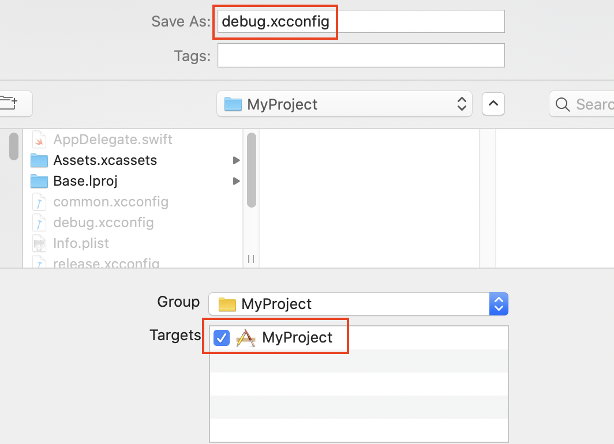
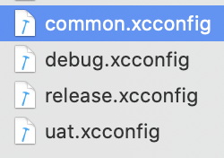
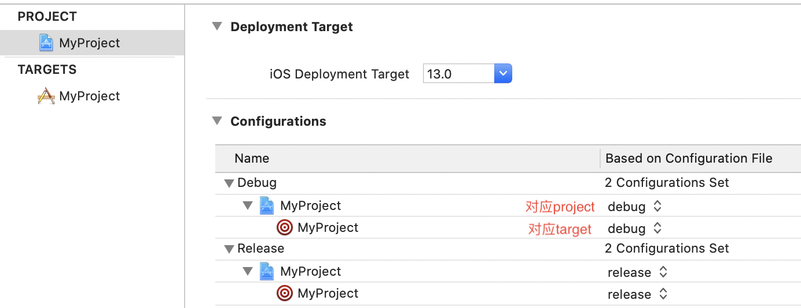
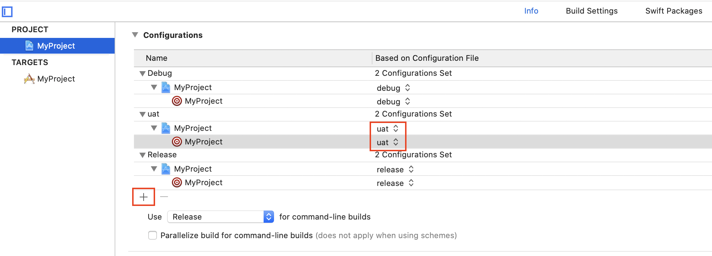
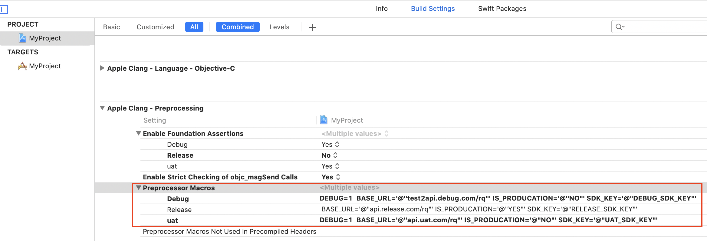
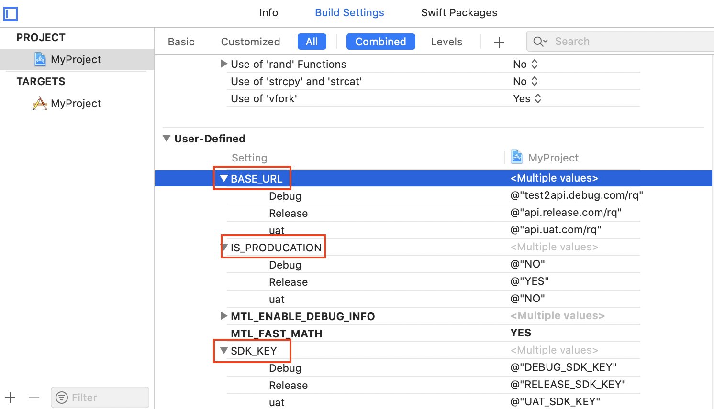

# gxcconfig

参考：  
- [Apple](https://help.apple.com/xcode/#/dev745c5c974)  
- [Apple](https://help.apple.com/xcode/mac/11.4/#/deve97bde215)
- [https://www.jianshu.com/p/aad1f9e72382](https://www.jianshu.com/p/aad1f9e72382) 
- [Apple config keys](https://help.apple.com/xcode/mac/11.4/#/itcaec37c2a6)  
- [XcodeBuildSettings.com](https://xcodebuildsettings.com/)
- [segmentfault](https://segmentfault.com/a/1190000004080030)
- https://blog.csdn.net/wei78008023/article/details/79925754
https://nshipster.com/xcconfig/
- Matt: https://nshipster.com/xcconfig/
- https://nshipster.cn/   good


在工作中，我们经常会遇到环境配置的事, 随着开发环境的变化而使用不同的配置，比如有开发、测试、发布等三个环境，每个环境都有自己的接口访问地址，以及一些第三方SDK的Key配置  

在代码中可以通常下面这种方式处理进行区分:  

```
#ifdef DEBUG
#define BaseURL @"192.168.102.111:8080/appname/api"
#define PublicKEY @"3TTY59QWE3RWR00WRET3C23WURI22R2X"
#else
#define BaseURL @"http://api.appname.com"
#define PublicKEY @"5FH53UB5M932R7O7M2XQWTDG42G75343"
#endif
```

在实际开发中, 除了上面这种方式外, 也可以使用`.xcconfig`配置文件的方式处理, xcconfig(Configuration Settings File)常用来做多环境配置, Xcode会根据当前模式(Debug, Release, Others...)自动选择对应的配置文件去加载   

.xcconfig文件是通过文本方式指定build settings的一种形式, Apple对xcconfig的定义:  

> A Configuration Settings File (a file with a .xcconfig file extension), also known as a build configuration file or xcconfig file, is a plain text file that defines and overrides the build settings for a particular build configuration of a project or target. 

### 示例(Objective-C)

新建一个iOS的工程, 然后建几个xcconfig文件： `File > new > Configuration Settings File`, 比如：  



  

**debug.xcconfig**  
```
// https://help.apple.com/xcode/#/dev745c5c974


// APP 请求地址
// http:\/\/test2api.xiaowei.com/rq
// xcconfig认为//是注释符，因此需要转义
// 但是这样通过[[NSBundle mainBundle].infoDictionary objectForKey:@"BasicURL"]得到的结果是未转义的字符串：http:\/\/test2api.xiaowei.com/rq
// NSLog得到的字符串也是BasicURL
// 因此建议不要写//
BASE_URL = @"test2api.debug.com/rq"   // BASE_URL
SDK_KEY = @"DEBUG_SDK_KEY"            // SDK_KEY
IS_PRODUCATION = @"NO"                // 是否试生产环境

#include "common.xcconfig"
```

**release.xcconfig**
```
BASE_URL = @"api.release.com/rq" // BASE_URL
SDK_KEY = @"RELEASE_SDK_KEY"     // SDK_KEY
IS_PRODUCATION = @"YES"          // 是否试生产环境

#include "common.xcconfig"
```

**uat.xcconfig**  
```
BASE_URL = @"api.uat.com/rq" // BASE_URL
SDK_KEY = @"UAT_SDK_KEY"   // SDK_KEY
IS_PRODUCATION = @"NO"     // 是否试生产环境

#include "common.xcconfig"
```

**common.xcconfig**
```
//  如果你使用 CocoaPods，你应该相应地在你的配置文件之一中包括（include）Pods.debug.xcconfig 或者 Pods.release.xcconfig
//

GCC_PREPROCESSOR_DEFINITIONS = $(inherited) BASE_URL='$(BASE_URL)' IS_PRODUCATION='$(IS_PRODUCATION)' SDK_KEY='$(SDK_KEY)'
```

common.xcconfig中暴露自定义键时的语法： `宏名='$(key)'`  
- `宏名`可以在代码或其他地方引用
- '$(key)'：通过key来指定每个模式下的对应的自定义键的名字，通常将宏的名字和key的名字保持一致， 注意等号前后一定不能有空格

然后在Info中指定Project或Target的config:  



-----------------------------------------

### 测试使用  

首先, 上面建立了uat.xcconfig, 应该对应uat环境, 但系统默认只有Debug和Release, 我们可以在Configuration中新建一个uat:  



左上角 MyProject > Edit Scheme > Run > Build Configuration 中选择相应的Configuration

```Objective-C
@implementation ViewController

- (void)viewDidLoad {
    [super viewDidLoad];
    
    NSLog(@"BASE_URL --> %@", BASE_URL);
    NSLog(@"IS_PRODUCTION --> %@", IS_PRODUCATION);
    NSLog(@"SDK_KEY --> %@", SDK_KEY);
}

@end

//打印结果(ua环境):
 BASE_URL --> api.uat.com/rq
 IS_PRODUCTION --> NO
 SDK_KEY --> UAT_SDK_KEY
```

以上代码见 `./demos/MyProject`

-----------------------------------------

### 原理 

只所以在代码中可以使用 `BASE_URL`, `IS_PRODUCATION`, `SDK_KEY`, 其本质是使用了`预定义宏`  





