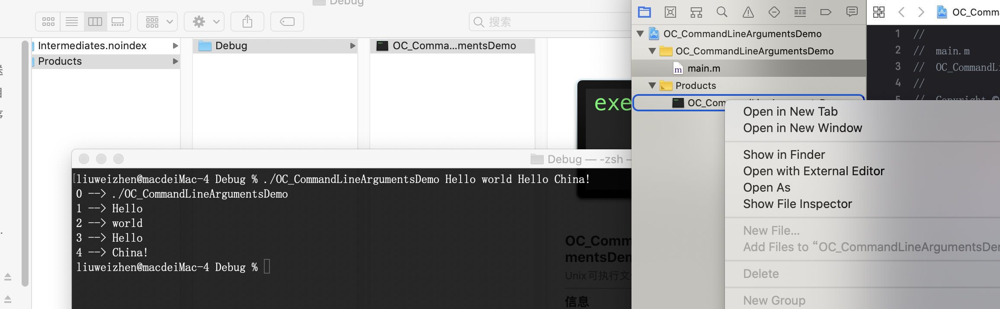

# 命令行OC

OC中可以直接通过main函数获取命令行参数

```Objective-C
#import <Foundation/Foundation.h>

int main(int argc, const char * argv[]) {
    @autoreleasepool {
        //https://stackoverflow.com/questions/18649547/how-to-find-the-length-of-argv-in-c
        /**OK
        int count = 0;
        while (argv[++count] != NULL);
        */
        
        //argv is an array of pointers to char (i.e. array of strings). The length of this array is stored in argc argument
        for (int i = 0; i < argc; i++) {
            printf("%d --> %s\n", i, argv[i]);
        }
    }
    return 0;
}
```

编译运行, 找到Products:  

  

```
% ./OC_CommandLineArgumentsDemo Hello world Hello China!                                                                                 
0 --> ./OC_CommandLineArgumentsDemo
1 --> Hello
2 --> world
3 --> Hello
4 --> China!
```

同理, 像上一篇一样, 这些参数也可以在XCode的Scheme中配置  

