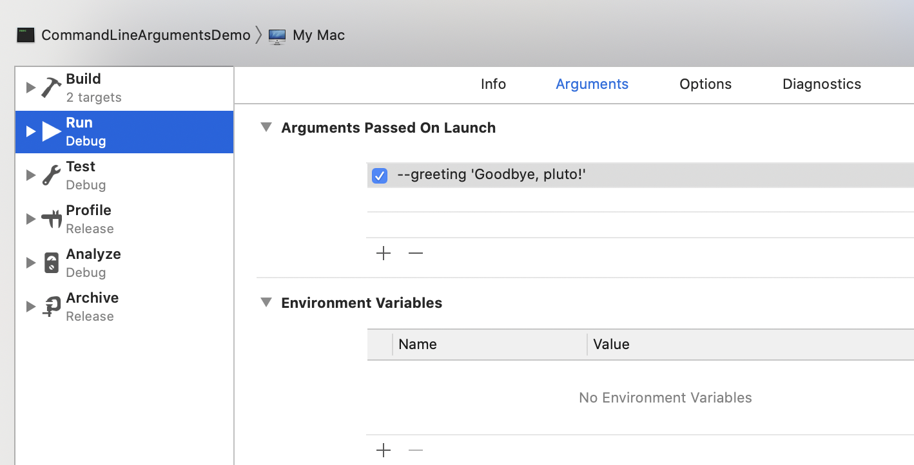

# 命令行Swift

Swift中有一个系统提供好的类专门处理命令行参数: `CommandLine`, 下面参考一篇很说细的文章:  
- [Jeffrey Fulton](https://jeffreyfulton.ca/blog/2018/08/using-command-line-arguments-to-configure-in-app-dependencies)  

由于参考的原作者写的很好, 也较详细, 此处原封不动摘录重点备记  

```
$ mkdir CommandLineArgumentsDemo
$ cd CommandLineArgumentsDemo
$ swift package init --type executable
$ swift build
$ .build/debug/CommandLineArgumentsDemo
> Hello, world!

$ swift package generate-xcodeproj
$ open CommandLineArgumentsDemo.xcodeproj/
```

```swift
if let commandIndex = CommandLine.arguments.index(of: "--greeting") {
    // Get next index and ensure it's not out of bounds.
    let valueIndex = CommandLine.arguments.index(after: commandIndex)
    if valueIndex >= CommandLine.arguments.startIndex
        && valueIndex < CommandLine.arguments.endIndex
    {
        let greeting = CommandLine.arguments[valueIndex]
        print(greeting)
    }
} else {
    print("Hello, world!")
}
```

```
$ swift build
$ .build/debug/CommandLineArgumentsDemo
> Hello, world!
$ .build/debug/CommandLineArgumentsDemo --greeting 'Goodbye, pluto!'
> Goodbye, pluto!
```

Success! That's great but all that command-line argument boiler plate parsing is tedious and error prone. Here's a few extensions I've created to help out.  

```swift
extension CommandLine {
    struct Option {
        let commandArgument: String
        let valueArgument: String?
    }

    static func option(for commandArgument: String) -> Option? {
        guard let commandIndex = CommandLine.arguments.index(of: commandArgument) else {
            return nil
        }
        let valueArgument = CommandLine.arguments.element(after: commandIndex)
        return Option(commandArgument: commandArgument, valueArgument: valueArgument)
    }
}

private extension Array where Element: Hashable {
    func element(after index: Index) -> Element? {
        let nextIndex = self.index(after: index)
        return self.element(at: nextIndex)
    }
    private func element(at index: Index) -> Element? {
        guard index >= self.startIndex else { return nil }
        guard index < self.endIndex else { return nil }
        return self[index]
    }
}

if let greetingOption = CommandLine.option(for: "--greeting"),
    let greeting = greetingOption.valueArgument
{
    print(greeting)

} else {
    print("Hello, world!")
}
```

Last but not least, Xcode allows us to define command-line arguments per scheme which get passed to our app when we run inside Xcode. This means we can skip the manual build and run steps in the terminal. Here's how to configure it:

Edit Scheme ... > Arguments > Add ...

